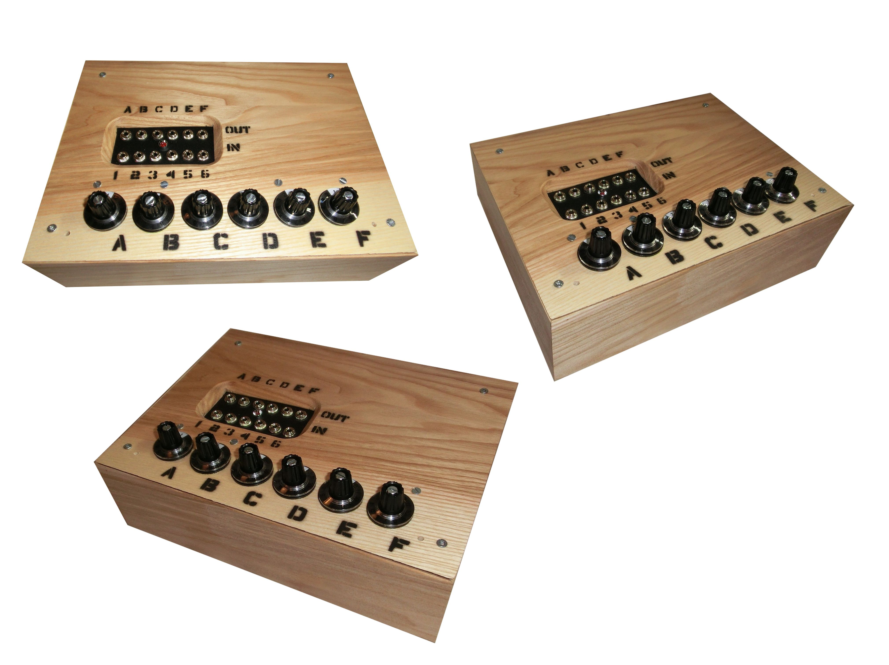
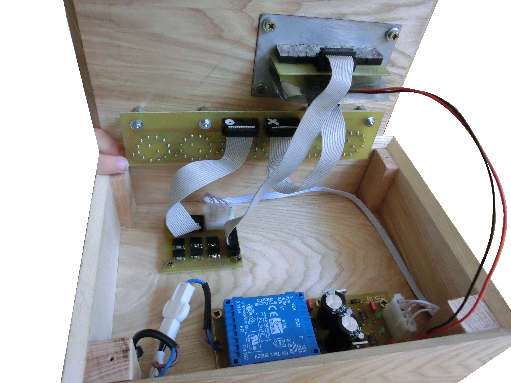

# Audio-Matrix-Emmelie-v3.2
Aktive Audio-Matrix (6x6), welche 6 Eingangskanäle auf 6 Ausgangskanäle abbilden kann. Anschluss über 3.5 Klinkekabel. Kompatibel mit Linesignalen (Aux, Kopfhörer, aktive Lautsprecher, …).

Active audio matrix (6x6), which can map 6 input channels to 6 output channels. Connection via 3.5 jack cable. Compatible with line signals (aux, headphones, active speakers, ...).

###### Kollage Audio Matrix Emmelie v3.2

###### Das innere der Audio Matrix Emmelie v3.2

