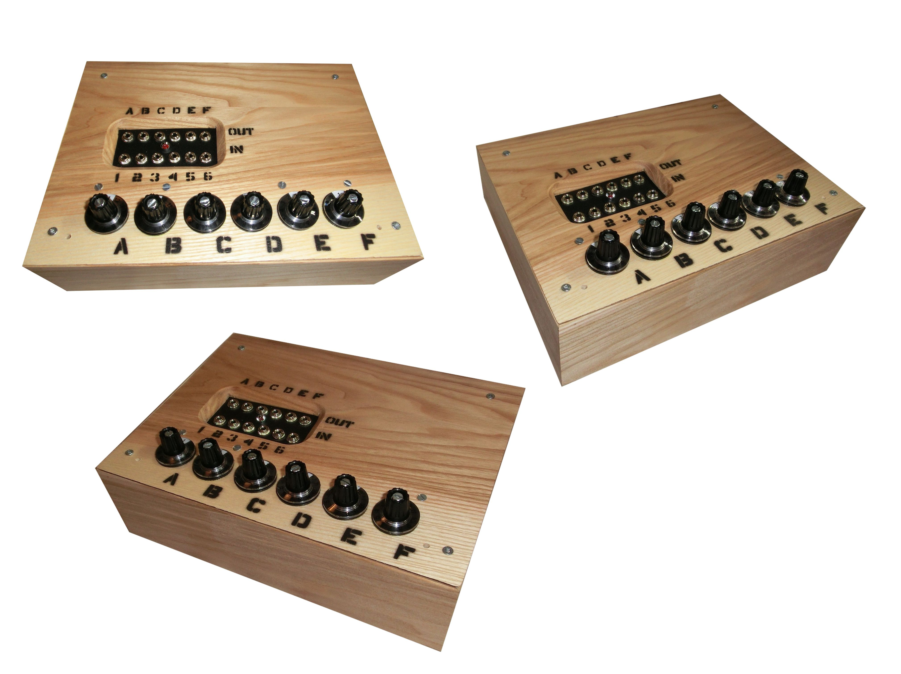
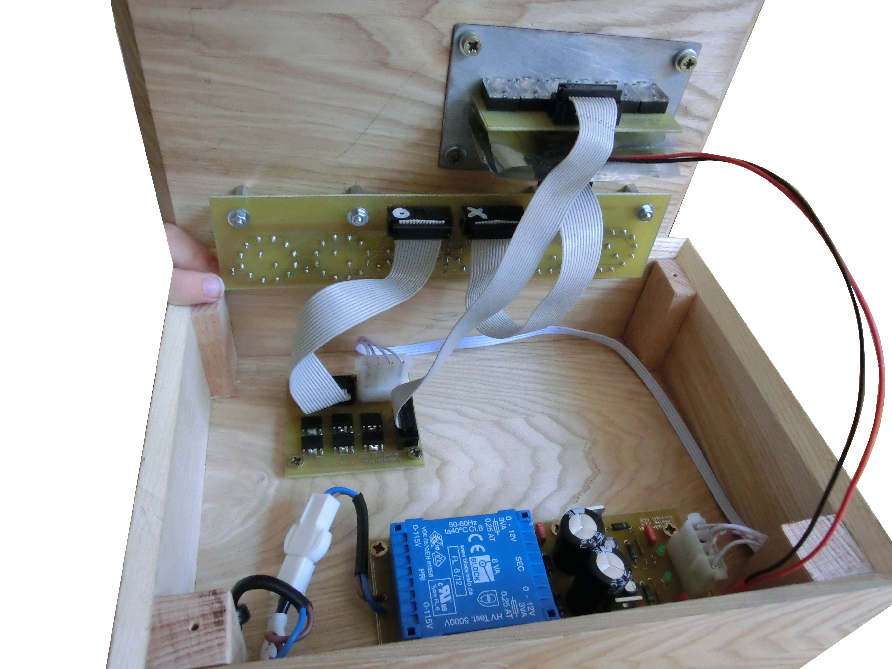
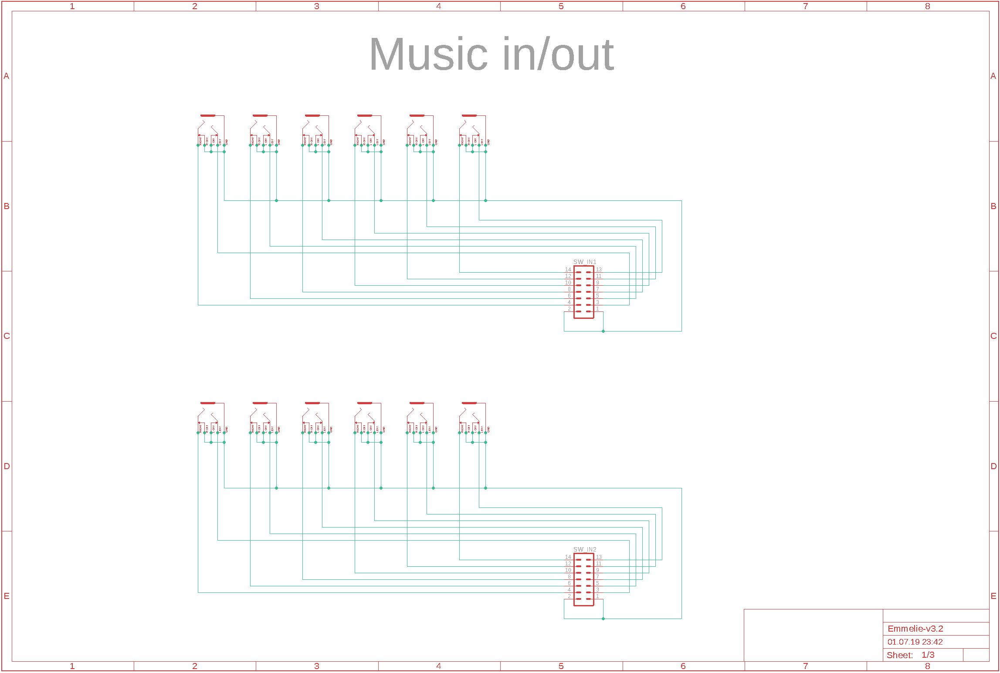
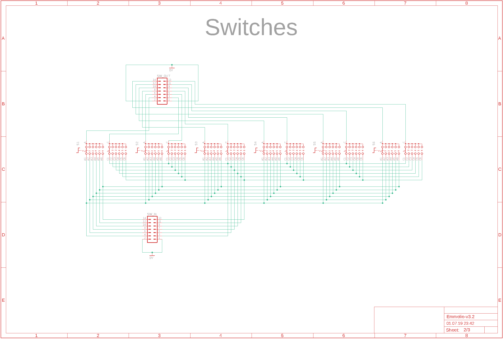
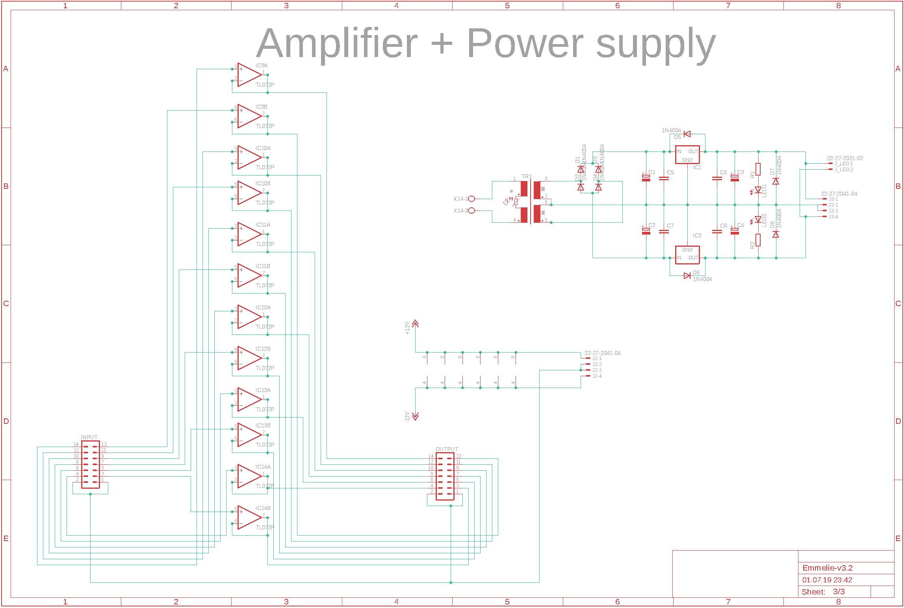
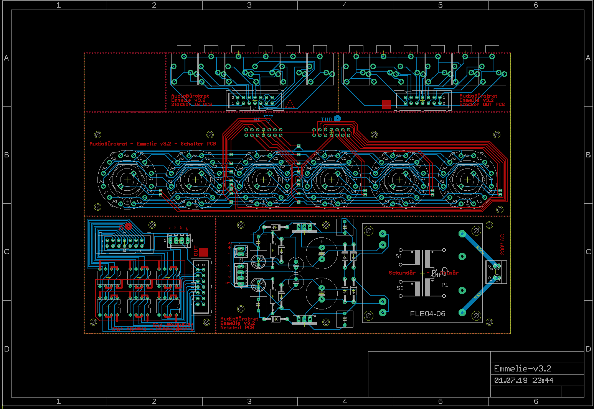

# Audio Matrix Emmelie v3.2

Active audio matrix (6x6), which can map 6 input channels to 6 output channels. Connection via 3.5 jack cable. Compatible with line signals (aux, headphones, active speakers, ...).

*Fork me and have fun!*

## Pictures

## Schematic

## Board

